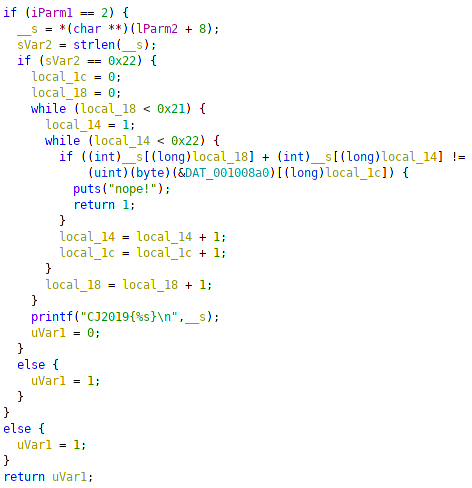
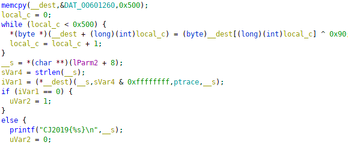

# Cyber Jawara 2019 Qualifiers

For all source code and binaries see attachments folder

Problems me and my team solved (Including upsolves). In this repo i will only explain binex and reversing problems
* Starlight (Binary Exploitation)
* Noir (Binary Exploitation)
* Homelander (Binary Exploitation)
* newbie.exe (Reverse Engineering)
* Haseul (Reverse Engineering)
* Gowon (Reverse Engineering)
* Hyunjin (Reverse Engineering) (upsolve)
* Sanity Check (Cryptography)
* Insanity Check (Cryptography)
* RC4 (Cryptography)
* Cj.docx (Digital Forensics)
* audit.log (Digital Forensics)
* Split (Network)
* Exfiltration (Network) (upsolve)
* Mysterious (Web Hacking)
* Under Construction (Web Hacking)
* Chuu (Web Hacking)
* Heejin (Web Hacking)


### Starlight

Injection in file name, because the program uses snprintf it is possible to truncate the leading ".lang" by using a payload that includes many "./"
Payload i used(python): 
```python
"./"*53 + "../flag.txt"
```

Flag: CJ2019{just_like_vulnerability_in_fortigate_vpn_CVE-2018-13379}


### Noir

Buffer overflow on stack, we are able to increase any value on the stack, in this case the return address. Adding 3 to the return address to the hidden shell function. It is also possible to create a ropchain, ofcourse the chain would take a long time to make.
Payload i used(python): 
```python
"1006\n"*4 + "-1"
```

Flag: CJ2019{can_u_pwn_this_without_hidden_shell_function?}


### Homelander

Service uses ubuntu 18.04, which means it uses libc 2.27! Most possible problem is tcache poisoning, which is exactly what it is.

Use after free, 16 total chunks possible to be used, double free, a pwners dream. <br>
First we need a libc leak, just fill the tcache bin with 7 chunks and free another after, than read the chunk, easy enough <br>
After that just write a one_gadget to \_\_free_hook and get shell

Flag: CJ2019{>>\*>\_\_>remember,_you_guys_are_the_real_pwners_<\*<<\*<}


### newbie.exe

PE32+ file, thankfully ghidra can decompile it easy (I use ubuntu). It ended up just being reversing this line


A few lines of python code did the trick

Flag: CJ2019{17db80b6de7d266f20fc855919b1ab61c27b60ae}


### Haseul

This time it was an elf file, same static reversing though. A bit harder since the input in dependant on each other, seems like a job z3 would solve easily



z3 did it in about 2 seconds

Flag: CJ2019{y0u_can_s0lve_thi5_ea5ily_usin9_Z3}


### Gowon

Slight dynamic reversing, \_\_dest is decoded to be a pointer to a function
the function can be accessed with gdb, because the asm is long i wont post a picture



This function in short just takes 4 arrays, our input, A, B, and C and does a simple manipulation

The equations ends up being (input - a) ^ b == c\
If the equation is true then the input is the flag\
So the flag is (c ^ b) + a

Flag: CJ2019{cR34tInG_sh377c0de_iN_ASM_i5_FUN}


### hyunjin (upsolve)

Web assembly reversing
I've never read wasm before but this wasnt too hard
The full asm file can be found in the archive
Disassembly was done with wasmdump and wasm module in python

The code is basically calculates the "xth" fibonacci number, where x is the ordinal value of each character in our input. However, something to note is that the wasm file used unsigned 64-bit integers, so i used the ctypes module in python

Flag: CJ2019{m0d3rn_pr0gramm1ng_lang_c4nt_save_ur_BAD_alg0r1thm}