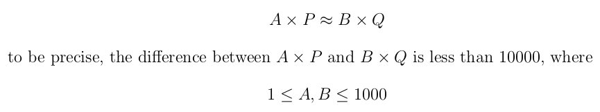
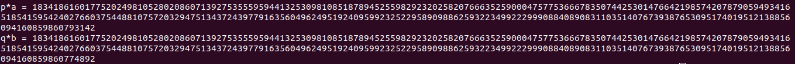

## CryptoCaulingo

Probably my favorite question of the Beginners Quest

So its basically RSA, but with huge N and a little constrant

I started scribbling on a paper how to do it, and quickly thought of fermat factorization

##### How?

So basically I would brute force A and B, and do fermat factorization on N\*A\*B. Why? Because N = P\*Q so N\*A\*B = P\*A\*Q\*B. and since abs(P\*A - Q\*B) <= 10000, fermat *should* work like a charm.

#### Boy was i wrong

It took about 10 minutes to run, and to my surprise it didnt find factors :(

I starting trying to fix maybe integer sqrt function, maybe fermat function, it just didnt work. So I decided to sleep and the next day I had an idea that *maybe* increasing the range of A and B could work.

To make a long story short, it did.

Easy gcd between N and the found factors of N\*A\*B gives use P and Q like a charm

### Flag  
CTF{017d72f0b513e89830bccf5a36306ad944085a47}

