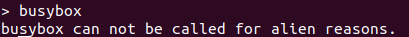
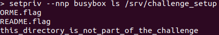
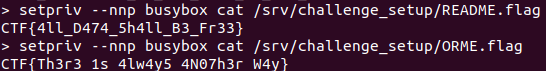

## WorkComputer

My first bash-like question I actually solved, learnt alot.  At first I tried to see what I could do, obviously I looked at /bin. Nothing really familiar (I'm still a noob at linux) but one binary really caught my attention, setpriv

I realized that there is a busybox binary, that could probably give me more binaries to use, but i couldn't access it

I fiddled around at it turns out `setpriv --nnp` gives us uid 0 (which somehow isnt root (?) ), this is intereting because maybe uid 0 has more ownership in the shell.

Also it turns out with `setpriv /bin/busybox` I can run the binaries in busybox, such as cat, less, etc. But with this im still uid 1338. 

So combining the 2 tricks above I can use the other binaries with "root" (uid 0 :P)

#### Unintended Solution :o

I found using `ls -Rla` that there is a folder named /srv/challenge_setup, owned by uid 0. Looking into the folder I see this xD

"Whoops I dont think i should be here", oh well I'll just try to cat the files..."

"Wow it worked"

##### Flags  
* CTF{4ll_D474_5h4ll_B3_Fr33}
* CTF{Th3r3_1s_4lw4y5_4N07h3r_W4y}

#### Easier way

`setpriv --nnp` isnt good actually, I could instead just do `setpriv busybox` and do a chmod on both README.flag and ORME.flag in /challenge. Oh well atleast i solved it and learnt alot