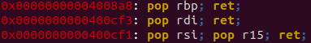
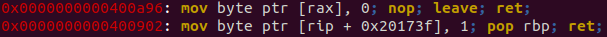
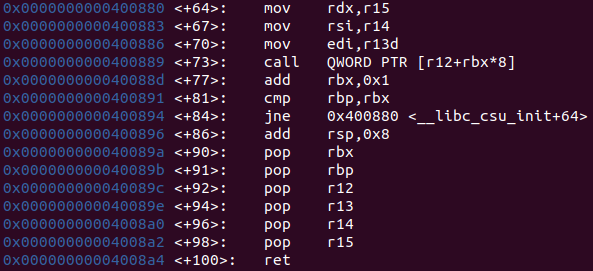
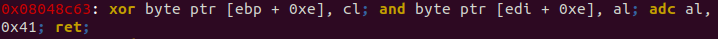

# Return Oriented Programming (ROP)

Return Oriented Programming or commonly shorted as ROP, is usually used when it is possible to control the stack pointer. ROP greatly depends on the “gadgets” used. 

Gadgets are small pieces of executable code found throughout the program which usually end in “ret” (opcode: ‘c3’). Besides ret, instructions such as “jmp”, “call” can also be used, but “ret” is the most used overall.

Examples:\



There are various tools that can be used to find gadgets, such as [ropper](https://github.com/sashs/Ropper) and [ROPgadget](https://github.com/JonathanSalwan/ROPgadget). [ropshell](http://www.ropshell.com) is also good, but it isn’t a tool more such a database.

Below are some techniques I’ve found very useful:\
Most of these techniques can be learnt at [ropemporium](https://ropemporium.com), I’ve also included other example problems.

### Jump to function
Change the return address to the valued function, parameters are in:
* The stack, on 32 bit architectures
* rdi, rsi, rdx, rcx, r8, r9, stack, respectively, on 64 bit architectures

Example questions: [FuzzyLand](https://fuzzy.land) buffer overflow 1 & 2, [pwnable.tw](https://pwnable.tw) dubblesort

### Call more than 1 function 	
When returning to more than 1 function, previous function parameters can get in the way if they are located in the stack. In order to avoid possible segmentation faults, whenever a function call requires parameters in the stack (32 bit or 64 bit, 64 bit is less common) the ROP chain should be formatted as follows:

`<important function to call> + <function to return to after previous function is finished> + <parameters>`

The function to return to is usually the function where the bug is located, however in some cases returning to \_start or main is also fine (and sometimes recommended)

### Change function parameters in 64 bit architectures
Use \__libc_csu_init. This function contains pop r14 and pop r15 respectively. r14 contains 2 opcodes, the latter of which is pop rsi (opcode: ‘5e’). Pop r15 contains 2 opcodes, the latter of which is pop rdi (opcode: ‘5f’). These are especially useful for system call attacks, in which the address of /bin/sh is required to be the parameter.

Example questions: [pwnable.tw](https://pwnable.tw) silver\_bullet

### Change function parameters in 64 bit architectures (part 2)
Most of the time, 2 parameters are enough for everything needed in a good ropchain, but that is not always the case in harder problems. In 64 bit, the 3rd parameter is kept in the ‘rdx’ register. Luckily, there is a mov rdx, (r15/r14/r13, depends on compiler) instruction in \__libc_csu_init. This is not found with ropper or ROPgadget, because it’s pretty far off from a “ret” instruction. Below is an example from one of the binaries I have:



As you can see, there is a lot more to handle in this case. For one, there is a call to the function that is located at r12 + rbx\*8, and another one is rbp and rbx must be the same, or else the jump is taken. This can be learnt by solving ropemporium problem “ret2csu”. Take a shot at it.

### Leak libc
Jump to puts plt, or printf plt, with respective got address we want to leak as parameter.\
Refer to [2](#call-more-than-1-function)

Example questions: [Facebook ctf 2019](https://github.com/fbsamples/fbctf-2019-challenges) overfloat, [pwnable.tw](https://pwnable.tw) silver_bullet

### Create syscall chain
Every now and than, gadgets such as pop rax, pop rbx, and others can be used to construct a syscall. However, the instructions int 0x80 (for 32 bit) and syscall (for 64 bit) are not commonly found in a general binary, thus this trick is not often possible.

Example questions: [FuzzyLand](https://fuzzy.land) rop2shell

### One Gadget RCE
Turns out, libc has execve in it (hahaha). Using tools like one_gadget (requires ruby) finding these gadgets is easy. There is however, certain constraints to use the gadgets, usually things like stackpointer-0x40 is NULL and other stuff alike.\
Note: Because one gadgets are located in libc, a leak is usually required beforehand. Refer to [5](#leak-libc)\
Note 2: one gadgets aren’t generally used in ROP, they tend to be used to corrupt \__malloc_hook or \__free_hook

### Write What Where
Like format strings and tache poisoning, ROP can also be used to create write what where exploit. With ROP, abusing registers is the way to go. Here’s an example (found using ropper):


This gadget takes the value in “al" (last 8 bytes of rax) and places it where rdx points to. With rdx and rax setting gadgets (such as pop rdx, pop rax) a complete write what where exploit can be done.

### Write What Where (part 2)
When creating certain ropchains, bytes such as 00 or 0a is needed. However, some read functions stop reading at these bytes. This is a problem because it can end the ropchain prematurely. Bytes like these are called “badbytes”. Ropper and ROPgadget both have a “badbytes” option, these tools usually ignore the address altogether, but there is a way to use the badbytes in or ropchain by abusing operators such as add, inc, dec, xor, and, or. Examples:




### Stack pivoting
Some buffer overflows are too small, only being able to make a 1-3 long ropchain. However, there is a technique to “pivot” the stack to a different location (by changing the value of the stack pointer). Below is the explanation.

“[leave](http://home.myfairpoint.net/fbkotler/nasmdocc.html#section-A.4.136)” (opcode: ‘c9’) is an instruction that moves ebp to esp, then pops ebp . This usually occurs right before a ret instruction in a function. “leave” is used to destroy a stack frame. As I said, “leave” does a pop ebp instruction, in which the ebp is located just before the return address. By changing this, we can set ebp to any value we need. However, we have not yet pivoted the stack, but changing only the base pointer is also a handy trick. In order to change the value of the stack pointer, we need to something a little more clever, which is return to a “leave ret” instruction (leave and then ret). Almost every function includes this pair. Example below (imagine value before return address has been corrupted):

(before first leave)
```
ebp = 0xffff3dcc
esp = 0xffff3db0
```
(after first leave)
```
ebp = 0x08049a00 (pretend this is bss)
esp = 0xffff3dcc
```
(after second leave (return address corrupted))
```
ebp = 0xdeadbeef (corrupted value in bss)
esp = 0x08049a00
```

And with a longer ropchain in bss, RCE should be easy\
You can also pull this off in the heap, or even the stack

<br>
<br>
<br>
<br>

*Note: This is my first tips and tricks write, I am fully open to suggestions and critiques.*